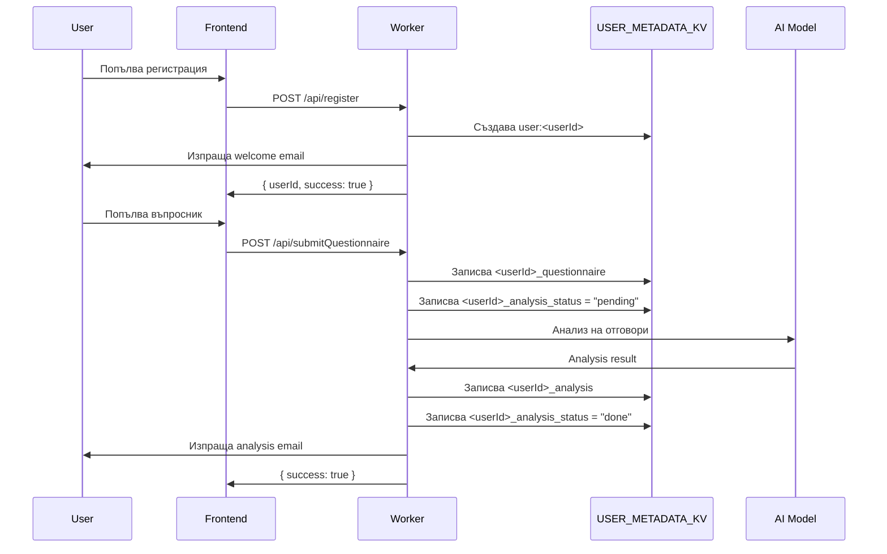
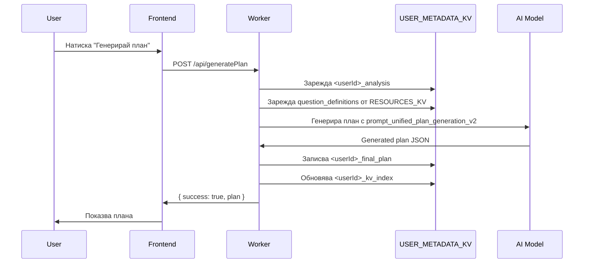
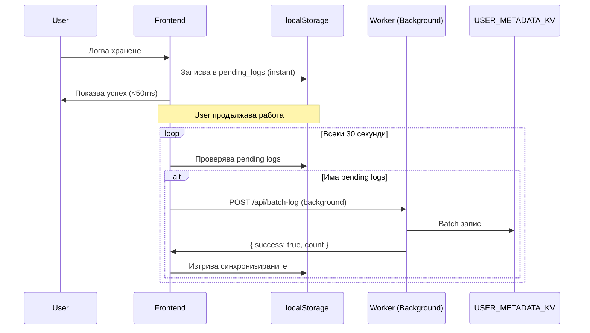
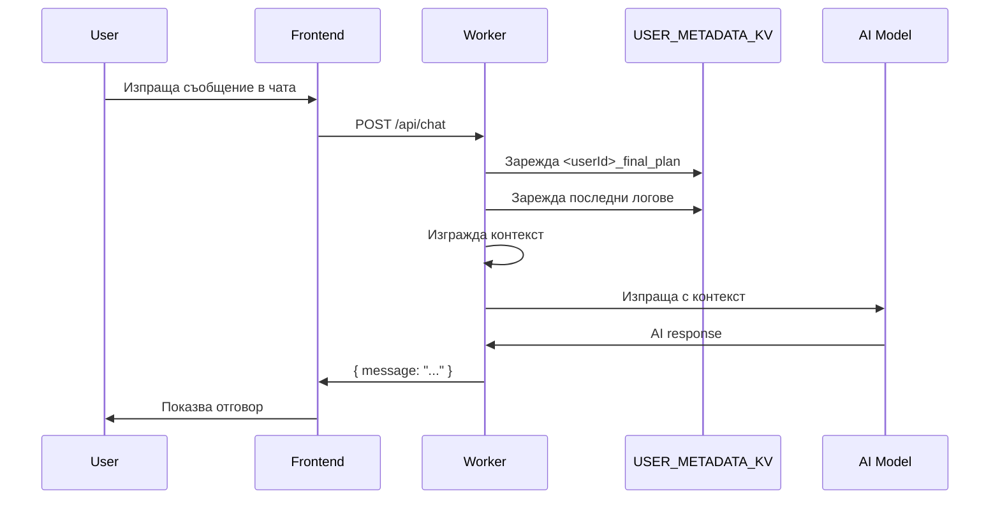
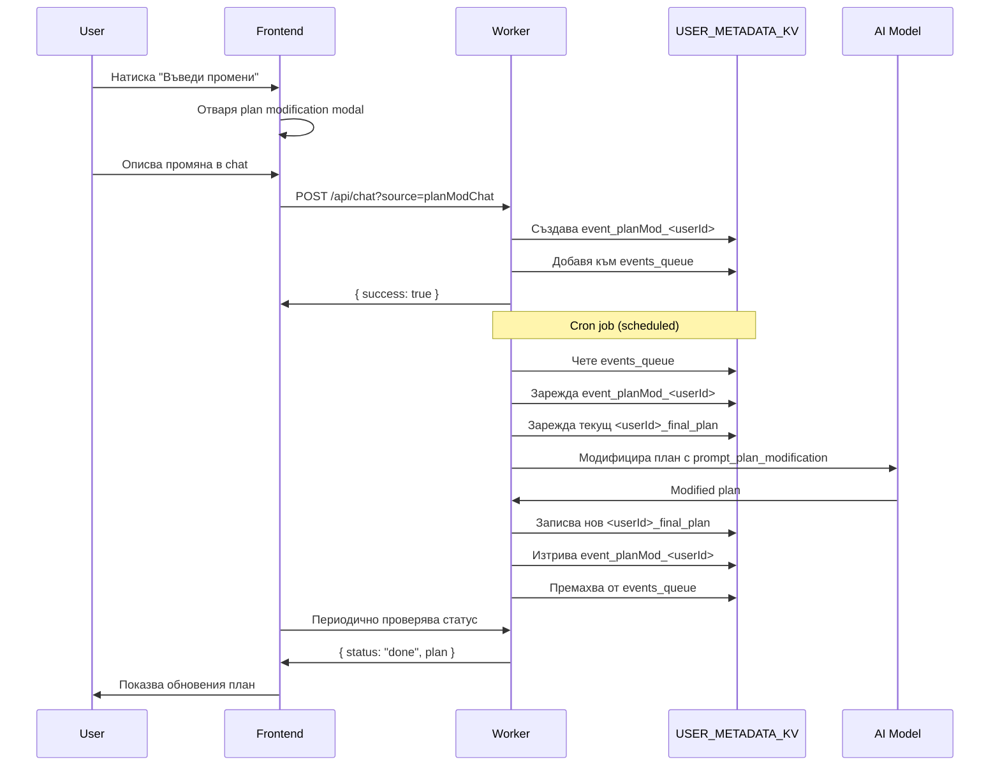

# BodyBest - Архитектура на проекта

> **Цел на документа:** Централизиран ресурс за бързо ориентиране в структурата, логиката и архитектурата на проекта.

## Съдържание

1. [Обща визия и философия](#обща-визия-и-философия)
2. [Технологичен стек](#технологичен-стек)
3. [Архитектурен модел](#архитектурен-модел)
4. [Структура на директориите](#структура-на-директориите)
5. [Frontend архитектура](#frontend-архитектура)
6. [Backend архитектура](#backend-архитектура)
7. [Съхранение на данни (KV)](#съхранение-на-данни-kv)
8. [API Endpoints](#api-endpoints)
9. [Потоци от данни](#потоци-от-данни)
10. [Разработка и тестване](#разработка-и-тестване)

---

## Обща визия и философия

**BodyBest** е прогресивно уеб приложение (PWA) за проследяване на хранене, тренировки и здравни показатели с AI-асистирано планиране.

### Основни принципи

- ✅ **Простота** - Най-простото работещо решение
- ⚡ **Ефективност** - Оптимизация на производителността
- 🎨 **Отлична визия** - Качествен UI/UX дизайн
- 📱 **Offline-First** - Работа без интернет връзка
- 🤖 **AI-Powered** - Интелигентни препоръки и адаптация

### Ключови функционалности

1. **Персонализиран хранителен план** - AI генериран план базиран на въпросник
2. **Проследяване на хранене** - Логване на хранения с offline поддръжка
3. **Аналитика и напредък** - Визуализации и AI анализ
4. **Чат асистент** - AI помощник с контекст от потребителските данни
5. **Административен панел** - Управление на AI модели, имейли, цветове
6. **Multi-tenant** - Поддръжка за множество потребители

---

## Технологичен стек

### Frontend
- **HTML5** - Семантична структура
- **CSS3** - Модулни стилове с CSS променливи
- **JavaScript (ES Modules)** - Нативни модули без bundler
- **Vite** - Dev server и build tool
- **Chart.js** - Графики и визуализации

### Backend
- **Cloudflare Workers** - Serverless API platform
- **Cloudflare KV** - Key-Value storage
- **Cloudflare AI** - AI модели за анализ и генериране
- **Node.js 18+** - Runtime за скриптове и тестове

### AI модели
- **Gemini** - Основен модел за планове
- **Claude** - Алтернативен модел
- **Llama 3** - Cloudflare AI модел
- **LLaVA** - Анализ на изображения
- **Cohere Command-R** - Специализиран анализ

### Инструменти
- **ESLint** - Linting
- **Jest** - Unit testing
- **TypeDoc** - API документация
- **Wrangler** - Cloudflare CLI

---

## Архитектурен модел

```
┌─────────────────────────────────────────────────────────────┐
│                     CLIENT (Browser)                         │
│  ┌────────────┐  ┌──────────────┐  ┌──────────────────┐    │
│  │   HTML     │  │  CSS Modules │  │  JS Modules      │    │
│  │  Pages     │  │  + Themes    │  │  (ES6 Modules)   │    │
│  └────────────┘  └──────────────┘  └──────────────────┘    │
│         │               │                    │               │
│         └───────────────┴────────────────────┘               │
│                         │                                    │
│                    localStorage                              │
│                  (Offline caching)                           │
└─────────────────────────┬───────────────────────────────────┘
                          │ HTTPS
                          │
┌─────────────────────────▼───────────────────────────────────┐
│              CLOUDFLARE WORKERS (Serverless)                 │
│  ┌──────────────────────────────────────────────────────┐   │
│  │                   worker.js                          │   │
│  │  ┌──────────────┐  ┌──────────────┐  ┌───────────┐ │   │
│  │  │ Auth & Users │  │ AI Services  │  │   Cron    │ │   │
│  │  └──────────────┘  └──────────────┘  └───────────┘ │   │
│  │  ┌──────────────┐  ┌──────────────┐  ┌───────────┐ │   │
│  │  │ Plan Gen     │  │   Analytics  │  │   Email   │ │   │
│  │  └──────────────┘  └──────────────┘  └───────────┘ │   │
│  └──────────────────────────────────────────────────────┘   │
│                                                              │
│  ┌──────────────────────────────────────────────────────┐   │
│  │              worker-backend.js (PHP proxy)           │   │
│  └──────────────────────────────────────────────────────┘   │
└─────────────────────────┬───────────────────────────────────┘
                          │
         ┌────────────────┼────────────────┐
         │                │                │
         ▼                ▼                ▼
┌─────────────┐  ┌──────────────┐  ┌──────────────┐
│ RESOURCES_KV│  │USER_METADATA │  │  External    │
│  (Config &  │  │    _KV       │  │   AI APIs    │
│   Prompts)  │  │ (User data)  │  │ (Gemini etc.)│
└─────────────┘  └──────────────┘  └──────────────┘
```

### Offline-First модел

```
User Action → localStorage (Instant) → Background Sync → Server
                    ↓
              Immediate UI Update
```

**Предимства:**
- Мигновен отговор (< 50ms)
- Работа без интернет
- 70-80% намаление на API calls
- Batch операции

---

## Структура на директориите

```
bodybest/
├── 📄 *.html                    # HTML страници (29 файла)
│   ├── index.html               # Главен dashboard
│   ├── landing.html             # Landing page
│   ├── quest.html               # Първоначален въпросник
│   ├── code.html                # Хранителен план
│   ├── admin.html               # Администраторски панел
│   ├── assistant.html           # AI chat асистент
│   ├── clientProfile.html       # Профил на клиент
│   └── ...
│
├── 📁 js/                       # JavaScript модули (50+ файла)
│   ├── app.js                   # Main app initialization
│   ├── auth.js                  # Authentication логика
│   ├── config.js                # Configuration constants
│   ├── offlineLogSync.js        # Offline logging система
│   ├── requestCache.js          # Persistent caching
│   ├── macroUtils.js            # Macro calculations
│   ├── planGeneration.js        # План генериране
│   ├── onboardingWizard.js      # Onboarding flow
│   ├── themeControls.js         # Тема управление
│   └── __tests__/               # Jest тестове
│
├── 📁 css/                      # CSS модули (18 файла)
│   ├── base_styles.css          # Основни стилове + теми
│   ├── index_styles.css         # Dashboard стилове
│   ├── quest_styles.css         # Въпросник стилове
│   ├── landing_styles.css       # Landing page стилове
│   └── ...
│
├── 📁 backend/                  # Backend тестове
│   └── tests/                   # Integration тестове
│
├── 📁 scripts/                  # Utility скриптове (17 файла)
│   ├── sync-kv.js               # KV синхронизация
│   ├── validate-json.js         # JSON валидация
│   ├── test.sh                  # Test runner
│   └── ...
│
├── 📁 docs/                     # Документация (20+ файла)
│   ├── DEV_GUIDE_BG.md          # Ръководство за разработчици
│   ├── IMPLEMENTATION_SUMMARY_BG.md
│   ├── QUESTIONNAIRE_ANALYSIS_CORRELATION.md
│   └── api/                     # TypeDoc генерирана документация
│
├── 📁 kv/                       # KV ресурси
│   └── DIET_RESOURCES/          # Diet промпти, данни, модели
│       ├── prompt_*.txt         # AI промптове
│       ├── question_definitions.json
│       ├── product_macros.json
│       └── ...
│
├── 📁 data/                     # Статични данни
│   ├── commonFoods.json
│   ├── welcomeEmailTemplate.html
│   └── ...
│
├── 📁 locales/                  # Локализация
│   ├── macroCard.bg.json
│   └── macroCard.en.json
│
├── 📁 img/                      # Изображения
├── 📁 mail/                     # Email скриптове
├── 📁 partials/                 # HTML частични шаблони
│
├── 🔧 worker.js                 # Main Cloudflare Worker (~9000 lines)
├── 🔧 worker-backend.js         # PHP proxy worker
├── 🔧 mailer.js                 # Email helper
├── 🔧 sendEmailWorker.js        # Email worker
│
├── ⚙️ package.json              # NPM dependencies & scripts
├── ⚙️ wrangler.toml             # Cloudflare Worker config
├── ⚙️ vite.config.js            # Vite configuration
├── ⚙️ jest.config.js            # Jest configuration
├── ⚙️ eslint.config.js          # ESLint rules
├── ⚙️ tsconfig.json             # TypeScript config
│
└── 📖 README.md                 # Main documentation
```

**Детайлно описание:** Виж [FILE_STRUCTURE.md](./FILE_STRUCTURE.md)

---

## Frontend архитектура

### Модулна организация

Frontend-ът е разделен на **независими ES6 модули** без използване на bundler. Всяка страница зарежда само необходимите модули.

#### Основни категории модули

```
js/
├── 🎯 Core (Ядро)
│   ├── app.js              # Main initialization
│   ├── config.js           # Configuration
│   └── utils.js            # Common utilities
│
├── 🔐 Authentication
│   ├── auth.js             # Auth логика
│   ├── authModal.js        # Login/Register модали
│   └── register.js         # Registration flow
│
├── 💾 Data Management
│   ├── offlineLogSync.js   # Offline logging (singleton)
│   ├── requestCache.js     # PersistentCache класове
│   ├── safeStorage.js      # localStorage quota handling
│   └── logger.js           # Centralized logging
│
├── 📊 Analytics & Planning
│   ├── macroUtils.js       # Macro calculations
│   ├── planGeneration.js   # План генериране
│   ├── planEditor.js       # Редактиране на план
│   ├── planModChat.js      # Plan modification chat
│   └── metricUtils.js      # Health metrics
│
├── 🎨 UI Components
│   ├── uiHandlers.js       # Event handlers
│   ├── uiElements.js       # DOM manipulation
│   ├── themeControls.js    # Theme switching
│   ├── themeConfig.js      # Theme definitions
│   ├── onboardingWizard.js # Onboarding flow
│   └── syncStatusIndicator.js # Sync status UI
│
├── 💬 Chat & AI
│   ├── chat.js             # Main chat
│   ├── assistantChat.js    # Assistant page chat
│   └── messageUtils.js     # Message formatting
│
├── 📝 Forms
│   ├── questionnaireCore.js # Въпросник логика
│   ├── extraMealForm.js    # Extra meal form
│   └── contactForm.js      # Contact form
│
├── 🎓 Admin
│   ├── admin.js            # Admin panel logic
│   ├── adminConfig.js      # AI model config
│   └── adminColors.js      # Theme editor
│
└── 🧪 Testing
    └── __tests__/          # Jest unit tests (40+ файла)
```

**Детайлна карта:** Виж [MODULE_MAP.md](./MODULE_MAP.md)

### Ключови шаблони

#### 1. Singleton модули
Модули като `offlineLogSync.js` и `requestCache.js` използват factory функции за singleton instance:

```javascript
// offlineLogSync.js
let instance = null;

export function getOfflineLogSync(options = {}) {
  if (!instance) {
    instance = new OfflineLogSync(options);
  }
  return instance;
}
```

#### 2. Event-driven architecture
Модулите комуникират чрез custom events:

```javascript
// offlineLogSync.js емитва събития
window.dispatchEvent(new CustomEvent('offlineSyncStatus', {
  detail: { status: 'syncing', pending: count }
}));

// syncStatusIndicator.js слуша
window.addEventListener('offlineSyncStatus', (e) => {
  updateIndicator(e.detail.status);
});
```

#### 3. Lazy loading
Тежки модули се зареждат динамично:

```javascript
// script.js (landing page)
async function showAuthModal() {
  const { setupAuthModal } = await import('./js/authModal.js');
  setupAuthModal();
}
```

### Themes система

Три теми + high contrast mode:
- **Light** - Светъл фон
- **Dark** - Тъмен фон
- **Vivid** - Ярки цветове
- **High Contrast** - Accessibility режим

Цветовете се съхраняват в CSS променливи:
```css
:root { --primary-color: #007bff; }
body.dark-theme { --primary-color: #4dabff; }
body.vivid-theme { --primary-color: #00d4ff; }
```

Управление: `js/themeControls.js` + `js/themeConfig.js`

---

## Backend архитектура

### Cloudflare Workers структура

#### Main Worker (`worker.js`)

Основният worker обслужва ~60 API endpoints. Структуриран е в секции:

```javascript
// worker.js структура (~9000 lines)

// 1. Imports & Configuration
import { Buffer } from 'node:buffer';
const CF_ACCOUNT_ID = env.CF_ACCOUNT_ID || 'xxx';

// 2. Utility Functions
function getLocalDate() { ... }
function sanitizeText(text) { ... }
function createUserKvIndex(userId, keys) { ... }

// 3. Authentication
async function authenticateUser(email, password, env) { ... }
async function registerUser(data, env) { ... }

// 4. AI Services
async function callOpenAI(messages, options, env) { ... }
async function callGemini(messages, options, env) { ... }
async function callCloudflareAI(model, messages, env) { ... }

// 5. Plan Generation
async function generateInitialPlan(userId, analysis, env) { ... }
async function modifyPlan(userId, userMessage, env) { ... }

// 6. Analytics
async function generatePraise(userId, env) { ... }
async function analyzeProgress(userId, env) { ... }

// 7. Cron Jobs
async function processScheduledTasks(env) { ... }

// 8. Main Request Handler
export default {
  async fetch(request, env, ctx) {
    const url = new URL(request.url);
    
    // Routing
    if (url.pathname === '/api/login') { ... }
    if (url.pathname === '/api/generatePlan') { ... }
    ...
    
    // Static file serving
    return env.ASSETS.fetch(request);
  },
  
  async scheduled(event, env, ctx) {
    // Cron handler
  }
}
```

#### Ключови секции

**1. User Management**
- `/api/register` - Регистрация
- `/api/login` - Вход
- `/api/getProfile` - Профил данни
- `/api/updateProfile` - Обновяване

**2. Plan Generation**
- `/api/submitQuestionnaire` - Първоначален въпросник
- `/api/generatePlan` - Генериране на план
- `/api/regeneratePlan` - Пълно регенериране
- `/api/modifyPlan` - Промяна на план
- `/api/checkPlanStatus` - Проверка на статус

**3. Logging**
- `/api/log` - Single log entry
- `/api/batch-log` - Batch logging (offline sync)
- `/api/log-extra-meal` - Извънредно хранене
- `/api/getDailyLog` - Дневен лог

**4. Analytics**
- `/api/getAnalytics` - Dashboard аналитика
- `/api/generatePraise` - AI похвала
- `/api/aiHelper` - AI съвети
- `/api/getInitialAnalysis` - Първоначален анализ

**5. Chat**
- `/api/chat` - AI чат
- `/api/analyzeImage` - Анализ на изображение

**6. Admin**
- `/api/getAiConfig` - AI модели config
- `/api/setAiConfig` - Промяна на AI config
- `/api/sendTestEmail` - Тестов имейл
- `/api/setMaintenanceMode` - Режим поддръжка

#### Backend Worker (`worker-backend.js`)

PHP proxy worker за Cloudflare AI:
- Приема POST заявки от PHP
- Извиква Cloudflare AI models
- Връща резултати в JSON

```javascript
// worker-backend.js (~200 lines)
export default {
  async fetch(request, env) {
    if (request.method !== 'POST') {
      return new Response('Method not allowed', { status: 405 });
    }
    
    const { model, prompt, image } = await request.json();
    const result = await env.AI.run(model, { prompt, image });
    return Response.json(result);
  }
}
```

#### Email Worker (`sendEmailWorker.js`)

Worker за изпращане на имейли:
- Приема `/api/sendEmail` заявки
- Интеграция с PHP backend
- Rate limiting

---

## Съхранение на данни (KV)

### KV Namespaces

#### 1. `RESOURCES_KV` - Конфигурация и ресурси

**Категории:**

**AI Prompts** (18 промпта)
```
prompt_unified_plan_generation_v2
prompt_questionnaire_analysis
prompt_plan_modification
prompt_chat
prompt_image_analysis
prompt_analytics_textual_summary
prompt_praise_generation
prompt_principle_adjustment
prompt_macro_calculation
...
```

**AI Models Configuration**
```
model_chat                    # @cf/meta/llama-3-8b-instruct
model_plan_generation         # gemini-1.5-pro
model_image_analysis          # @cf/llava-hf/llava-v1.6b
model_questionnaire_analysis  # claude-3-5-sonnet-20241022
...
```

**AI Parameters**
```
plan_token_limit    # 8000
plan_temperature    # 0.7
chat_token_limit    # 2000
chat_temperature    # 0.3
...
```

**Email Templates**
```
welcome_email_subject
welcome_email_body
questionnaire_email_subject
questionnaire_email_body
analysis_email_subject
analysis_email_body
password_reset_email_subject
password_reset_email_body
```

**Email Flags**
```
send_welcome_email          # "1"
send_questionnaire_email    # "1"
send_analysis_email         # "1"
send_contact_email          # "1"
```

**Diet Data**
```
allowed_meal_combinations   # JSON array
base_diet_model            # JSON object
eating_psychology          # Text
question_definitions       # JSON array
recipe_data               # JSON array
product_macros            # JSON object
nutrient_overrides        # JSON object
```

**Синхронизация:** `npm run sync-kv` (от `kv/DIET_RESOURCES/`)

#### 2. `USER_METADATA_KV` - Потребителски данни

**User records:**
```
user:<userId>                    # User profile
{
  userId: string,
  email: string,
  passwordHash: string,
  name: string,
  createdAt: number,
  lastLogin: number
}
```

**Plan data:**
```
<userId>_final_plan              # Generated plan
{
  meals: [...],
  caloriesMacros: {
    plan: { calories, protein_grams, carbs_grams, fat_grams },
    recommendation: { ... }
  },
  principles: [...],
  adaptiveQuiz: [...]
}

<userId>_questionnaire           # Initial questionnaire
<userId>_analysis                # Initial AI analysis
<userId>_analysis_status         # "pending" | "done" | "error"
```

**Daily logs:**
```
<userId>_log_<YYYY-MM-DD>        # Daily log
{
  date: "YYYY-MM-DD",
  meals: {
    breakfast: { consumed: true, time: "08:00" },
    ...
  },
  extraMeals: [
    { time, description, calories, protein, carbs, fat }
  ],
  water_intake: 2.0,
  weight_kg: 75.5,
  ...
}
```

**Events & Queue:**
```
event_<type>_<userId>            # Pending events
events_queue                     # Array of event objects
[
  { key: "event_planMod_123", type: "planMod", userId: "123" }
]
```

**Index:**
```
<userId>_kv_index                # User's important keys
[
  "<userId>_final_plan",
  "<userId>_questionnaire",
  "<userId>_log_2024-01-15",
  ...
]
```

### KV Операции

**Четене:**
```javascript
const plan = await env.USER_METADATA_KV.get(`${userId}_final_plan`, 'json');
```

**Запис:**
```javascript
await env.USER_METADATA_KV.put(
  `${userId}_final_plan`,
  JSON.stringify(plan),
  { expirationTtl: 60 * 60 * 24 * 365 } // 1 година
);
```

**Списък:**
```javascript
const list = await env.USER_METADATA_KV.list({ prefix: `${userId}_` });
```

**Индексиране:**
```javascript
// Създаване на индекс с важни ключове
const index = [
  `${userId}_final_plan`,
  `${userId}_questionnaire`,
  // ... други важни ключове
];
await env.USER_METADATA_KV.put(`${userId}_kv_index`, JSON.stringify(index));
```

---

## API Endpoints

### Пълен списък (60+ endpoints)

#### Authentication & Users
| Method | Endpoint | Description |
|--------|----------|-------------|
| POST | `/api/register` | Регистрация на нов потребител |
| POST | `/api/login` | Вход в системата |
| GET | `/api/getProfile` | Зареждане на профил |
| POST | `/api/updateProfile` | Обновяване на профил |
| POST | `/api/requestPasswordReset` | Заявка за нова парола |
| POST | `/api/performPasswordReset` | Задаване на нова парола |

#### Plan Generation & Modification
| Method | Endpoint | Description |
|--------|----------|-------------|
| POST | `/api/submitQuestionnaire` | Изпращане на въпросник |
| POST | `/api/generatePlan` | Генериране на план |
| POST | `/api/regeneratePlan` | Пълно регенериране |
| POST | `/api/modifyPlan` | Промяна на план |
| GET | `/api/checkPlanStatus` | Проверка на статус |
| GET | `/api/getPlan` | Зареждане на план |
| GET | `/api/checkPlanPrerequisites` | Проверка за prerequisites |

#### Logging
| Method | Endpoint | Description |
|--------|----------|-------------|
| POST | `/api/log` | Single log entry |
| POST | `/api/batch-log` | Batch операции (offline sync) |
| POST | `/api/log-extra-meal` | Извънредно хранене |
| GET | `/api/getDailyLog` | Дневен лог |
| GET | `/api/getLogs` | Множество логове |

#### Analytics
| Method | Endpoint | Description |
|--------|----------|-------------|
| GET | `/api/getAnalytics` | Dashboard данни |
| GET | `/api/getInitialAnalysis` | Първоначален анализ |
| GET | `/api/analysisStatus` | Статус на анализа |
| POST | `/api/generatePraise` | AI похвала |
| POST | `/api/aiHelper` | AI съвети |
| POST | `/api/acknowledgeAiUpdate` | Маркира AI update като прочетено |
| GET | `/api/getAchievements` | Постижения |

#### Chat & AI
| Method | Endpoint | Description |
|--------|----------|-------------|
| POST | `/api/chat` | AI чат |
| POST | `/api/analyzeImage` | Анализ на изображение |
| POST | `/api/runImageModel` | Direct Cloudflare AI image |
| POST | `/api/testAiModel` | Тест на AI модел |

#### Admin
| Method | Endpoint | Description |
|--------|----------|-------------|
| GET | `/api/getAiConfig` | AI конфигурация |
| POST | `/api/setAiConfig` | Промяна на AI config |
| GET | `/api/listAiPresets` | AI пресети |
| GET | `/api/getAiPreset` | Конкретен пресет |
| POST | `/api/saveAiPreset` | Запазване на пресет |
| POST | `/api/sendTestEmail` | Тестов имейл |
| POST | `/api/sendEmail` | Изпращане на имейл |
| GET | `/api/getMaintenanceMode` | Режим поддръжка |
| POST | `/api/setMaintenanceMode` | Задаване на режим |
| GET | `/api/peekAdminQueries` | Непрочетени заявки |
| GET | `/api/getAdminQueries` | Всички заявки |

#### Feedback
| Method | Endpoint | Description |
|--------|----------|-------------|
| POST | `/api/submitFeedback` | Обратна връзка |
| POST | `/api/recordFeedbackChat` | Отбелязване на чат |
| GET | `/api/getFeedbackMessages` | Съобщения |

#### File Management
| Method | Endpoint | Description |
|--------|----------|-------------|
| POST | `/api/uploadTestResult` | Изследване |
| POST | `/api/uploadIrisDiag` | Ирисова диагностика |

#### KV & Data
| Method | Endpoint | Description |
|--------|----------|-------------|
| GET | `/api/listUserKv` | KV ключове на потребител |

**Пълна документация:** Виж [API_REFERENCE.md](./docs/API_REFERENCE.md)

---

## Потоци от данни

### 1. Регистрация и първоначален въпросник



### 2. Генериране на план



### 3. Offline Logging



### 4. AI Chat с контекст



### 5. Промяна на план



---

## Разработка и тестване

### Development Setup

```bash
# 1. Clone
git clone https://github.com/Radilovk/bodybest.git
cd bodybest

# 2. Install
npm install

# 3. Start dev server
npm run dev
# → http://localhost:5173
```

### NPM Scripts

```bash
npm run dev          # Vite dev server
npm run build        # Production build
npm run lint         # ESLint
npm test             # Jest тестове
npm run test:watch   # Watch mode
npm run test:file <path>  # Конкретен файл
npm run test:related # Стейджнати файлове
npm run coverage     # Code coverage
npm run docs         # TypeDoc documentation
npm run sync-kv      # Sync KV resources
npm run deploy       # Deploy to Cloudflare
```

### Testing Strategy

#### Unit Tests (Jest)
```bash
js/__tests__/
├── adminConfig.test.js         # Admin configuration
├── auth.test.js                # Authentication
├── macroUtils.test.js          # Macro calculations
├── offlineLogSync.test.js      # Offline logging
├── requestCache.test.js        # Caching
├── themeAccessibility.test.js  # Accessibility
└── ... (40+ тестови файла)
```

**Изпълнение:**
```bash
npm test                        # Всички тестове
npm run test:watch              # Watch mode
npm run test:file js/__tests__/auth.test.js
```

#### Backend Tests
```bash
backend/tests/
├── checkPlanPrerequisites.test.js
├── regeneratePlan.test.js
└── submitQuestionnairePlanStart.test.js
```

#### Lint
```bash
npm run lint
# Автоматична поправка:
npm run lint -- --fix
```

### Debugging

#### Worker Logs
```bash
# Local dev
wrangler dev

# Production logs
wrangler tail
```

#### Browser DevTools
- Network tab: API заявки
- Application → localStorage: Offline данни
- Console: Debug съобщения

### Deployment

```bash
# 1. Локална валидация
npm run lint
npm test
npm run build

# 2. Deploy
npm run deploy
# или
wrangler deploy

# 3. Проверка
curl https://your-worker.workers.dev/api/healthcheck
```

**CI/CD:** GitHub Actions (`.github/workflows/deploy.yml`)

---

## Следващи стъпки

### За нови разработчици
🚀 **Започни с [QUICK_START.md](./QUICK_START.md)** - Бърз старт за работа с проекта

### За детайлна информация
- 📁 [FILE_STRUCTURE.md](./FILE_STRUCTURE.md) - Детайлна структура на файловете
- 🗺️ [MODULE_MAP.md](./MODULE_MAP.md) - Карта на модулите и техните отговорности
- 🔌 [API_REFERENCE.md](./docs/API_REFERENCE.md) - API endpoint документация (ако съществува)
- 🎨 [THEME_SYSTEM.md](./docs/THEME_SYSTEM.md) - Тема система (ако съществува)
- 📖 [DEV_GUIDE_BG.md](./docs/DEV_GUIDE_BG.md) - Ръководство за разработчици

### Допълнителна документация
- 📊 [ANALYTICS_FORMULAS_BG.md](./docs/ANALYTICS_FORMULAS_BG.md) - Формули за аналитика
- 🤖 [AI_PLAN_MODIFICATION_BG.md](./docs/AI_PLAN_MODIFICATION_BG.md) - AI план промени
- 📋 [QUESTIONNAIRE_ANALYSIS_CORRELATION.md](./docs/QUESTIONNAIRE_ANALYSIS_CORRELATION.md) - Анализ на въпросник
- ⚡ [OPTIMIZATIONS.md](./docs/OPTIMIZATIONS.md) - Оптимизации

---

**Последна актуализация:** 2024-12-08  
**Версия:** 1.0.0
